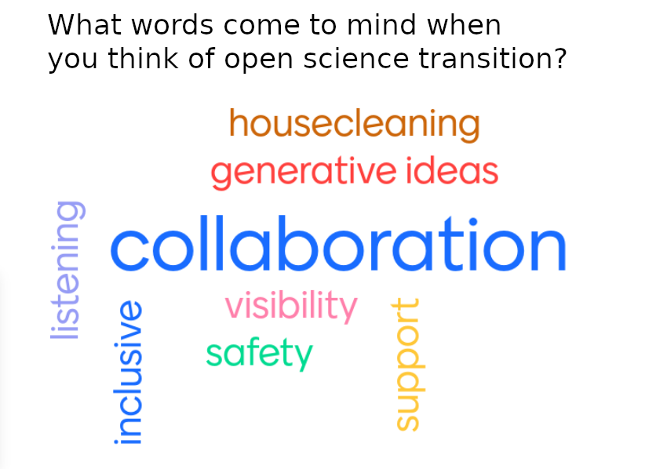

The following is a summary captured from a group note-taking document. Notes below may
each reflect a different speaker. When there was consensus in our notes, that will be
called out explicitly.

Quoted terms without context, e.g. "attractive fields", can be found in the reading!
:book:

## Attendees

Liz Cassano, Julia Collins, Erik Ramos, Robyn Marowitz, Matt Fisher, Amy Steiker, Andy
Barrett

## Why is open science important or interesting to you?

> I think open science is great to keep research accountable and allow more
> collaboration in the scientific community

> Open science is important so all people can participate in scientific discovery even
> if resources are not plentiful

> Open science is kinder, more inclusive, and collaborative science

* Reflects values we love from [Openscapes](https://openscapes.org/)

> Open science is better way of collaborating and building knowledge

> Open science is more inclusive, more feedback, opens the door to better science

* I think more feedback is so important!

## Word cloud

We used <https://menti.com> to do a brief survey:

## Discussion

* 3 people mentioned they enjoyed the part about dialogue vs. debate.
* 3 people mentioned they are thinking more about generative questions.
* 3 people mentioned they enjoyed the part about inviting a diversity of people
  who care.

### "Cheeks in chairs"

* Could be a useful method to narrow to a small number of ideas from a large number of
  perspectives.
* Gives people agency!

### Dialogic vs. traditional mindset

* I was confused by the terminology at first so I followed the citation through to
  [The Dialogic Mindeset for Generative Change (2018)](https://b-m-institute.com/wp-content/uploads/2019/11/TCH_chapter.pdf).
  I found the left column of Table 1 ("Most traditional change mindsets talk about...")
  really relatable for the way my brain tends to think (seeking objective truth,
  believing in rationality), but found the right column ("...but the Dialogic Mindset
  sees") to be closer to the way I want to think and see the world.

### What is "generative imagery"

* Reference:
  [Dialogic Organization Development: The Theory and Practice of Transformational Change.](https://www.gervasebushe.ca/otherdocs/Chap_5.pdf)

### How to bring these ideas back to NSIDC?

4 people felt this is important.

#### Open science working group

* Reflecting on "invite the diversity of people who care": do we have the right kinds of
  diversity in that group?
* Reflecting on "attractive fields" and "dancing on the edges": How big should the field
  be?
* Reflecting on "generative imagery": To be effective, should the scope of our working
  group go beyond recommending tactics and include things like building generative
  imagery?

### Effectiveness of open science efforts

* Some efforts feel like "checking a box". It would be more helpful if scientists, data
  managers, etc. had better understanding of "why" so we can tailor open science to
  real-world needs. Involve necessary perspectives, users _and_ practitioners.
* 2 kinds of open science:
    * Methodological, checking boxes: data available, code available, published open
      access, pre-print requirements, etc. These are mechanistically important and *easy
      to measure*.
    * "Open science is a kinder/more effective way of doing science": Being vulnerable,
      open to sharing, willingness to listen, trying not to hoard stuff, open to being
      wrong or sub-optimal *leads to better outcomes*. *Hard to measure*, but you know
      it when you see it. **"It feels good."**
        * Within NSIDC, if we can find better ways of working, e.g. share code and
          workflows between scientists and devs, we can have better interactions,
          **we can make more usable data**, and more.
    * Actually, probably more than two! :smile:
* 3 people like the idea of "generative image" / collective image that gives us
  something to hang our work off of.
* Open science can look very different depending on your role.
* Larger _institutional_ open science initiative feels more "top-down"; many of us are
  stakeholders with valuable perspectives! Could be more dialogic process.

### Creating an "attractive field"

* Practices for creating attractive fields can be invisible! But practicing is
  still important.
* Involving diverse people that care: Having passionate open science champions in
  different groups is key!
* On having multiple voices from some perspectives: there is "diversity within
  diversity"!
    * This comment on "diviserty within diversity" resonated with me on a personal level
      :smile:
* 2 people feel it's important to make room for people to "dance at the edges", not keep
  anyone out.

### "Differentiation"

* Has anyone noticed themselves differentiating in the context of open science
  transition?
    * I developed a new interest in inclusion, accessibility, education. Not really
      clear where it came from, but happened in last couple of years.
    * Through Openscapes, developed a less insular / linear approach to my work. Learned
      to work with others in parallel and asynchronously (e.g. GitHub, Slack), and it's
      been great! Still don't like pair programming as much, but Openscapes opened my
      mind to how powerful being vulnerable and working with others can be.
    * Noticing increased "we" mindset of working together towards a goal, OK to be
      vulnerable when on the same team. Group mindset "helps vulnerability not feel
      vulnerable"
        * 1 person liked this
    * Tight feedback loops. Suggestions and compromises.
        * _TODO: Can this note be improved?_

### Psychological safety

* I was nervous when I first started working on GitHub! Felt vvery vulnerable.
    * 2 people agreed: **With respect to open science, this pain of vulnerability is a
      foundational hurdle!**
    * It's not just you! _Everyone on the call nods vigorously at this point_
* Can CIRES new DEI director work with us on improving and modeling psychological safety
  in our workplace?

### Trust in science

* Getting fresh eyes on old/legacy stuff is critical for trusting science. There is
  shady science, incentives are a known problem. The only way around is transparency!
* There's stuff out there that's private, but authored by someone retired, passed away,
  or so far removed from the work that they can no longer understand it.
    * 2 people agreed: things are being lost, and it's a tragedy!
* Doing open science things is like listening to your grandmother reminding you to wear
  clean underwear just in case you end up in the hospital. It's a good idea just in
  case, but it's also a good idea _anyway_.

## Feedback

At time of writing this is the feedback we have. Please open a PR or reach out to any
reading club member to provide feedback to be posted here.

* 2 people agreed short articles are great for participation
* 2 people agreed voting in Slack is OK
* 2+ people agreed we should provide an "open science quick start" for newer folks
* Can / should we invite members of other communities to join us for future meetings?
